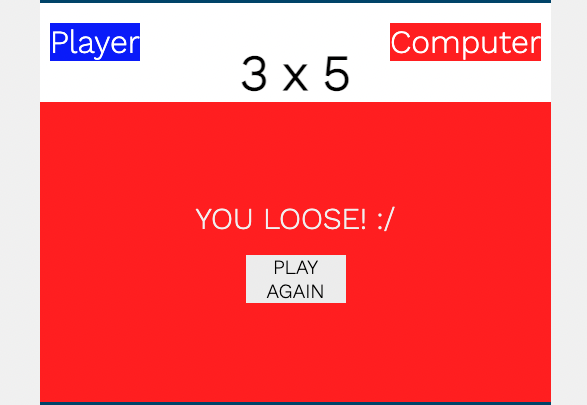

# **Rock Paper Scissors Game**

Rock Paper Scissors is an Ancient Game, and it is believe was created by the chinese people. The game has developed since its creation and now with help of JavaScript, it was possible to develop an website bringing this game to the digital world.


[Live DEMO](https://renatolemes.github.io/Rock-Paper-Scissors/)


## **Rules**

- **Rock** Cruches **Scissors**

- **Paper** Covers **Rock**

- **Scissors** Cuts **Paper**


## **Features**

Full Screen of the game:


This section, the player can choose which choise he will play againt the computer and click on the icon:


On the top part it shows the Scores. Bellow it shows firts the Gamer choice, then the computer choice. Whoever wins gets one point.


Screen shows that Gamer won, and they have a chance to continue playing clicking on the botton "play again":


Screen shows that Computer won, but game have a chance to continue playing clicking on the botton "play again"::




## **Testing**

### Performance

Lighthouse - Google webdev tool was used to test the performace:


### Validator Testing

- #### HTML
No errors were found. Tool used to validate: [W3C validator](https://validator.w3.org/nu/)

- #### CSS
No errors were found. Tool used to validate:: [(Jigsaw) Validator](https://jigsaw.w3.org/css-validator/)

- #### JavaScript
No errors were found. Tool used to validate: [Jshint validator](https://jshint.com/)
    This was the Metrics of the code:

```
- There are 8 functions in this file.
- Function with the largest signature take 1 arguments, while the median is 0.
- Largest function has 15 statements in it, while the median is 2.5.
- The most complex function has a cyclomatic complexity value of 12 while the median is 1.
```

### Unfixed Bugs

There are no Bugs left to be fixed.


## **Deployement**

The project was deployed to GitHub Pages using the following steps:

- Log in to GitHub and locate the [Rock Paper Scissor](https://github.com/RenatoLemes/Rock-Paper-Scissors) repository.
- Go to "Settings" Button on the menu.
- On settings in the left side of the page click on "Pages"
- click on "Select branch:" it will drop down. Select "Main", make sure the "Select folder" has "/root" selected.
- The page will automatically refresh and you receive message "Your site is published at https://renatolemes.github.io/Rock-Paper-Scissors/.


## **Credits**

### General Resource

These websites were used from inpiration and general resources for coding:

- JavaScript Essentials Material
- [Love Maths Project](https://renatolemes.github.io/love-maths/)
- [W3School](https://www.w3schools.com/)
- [MDN](https://developer.mozilla.org/en-US/)

### Color

Adobe color was used to find the perfect color for the project:

- [Adobe Color](https://color.adobe.com/search?q=1B262C&t=hex)

### Media

The Picture used were taken from this project:

- [Github](https://github.com/JLChamberlain/RPSLS/tree/master/IMG/SVG)